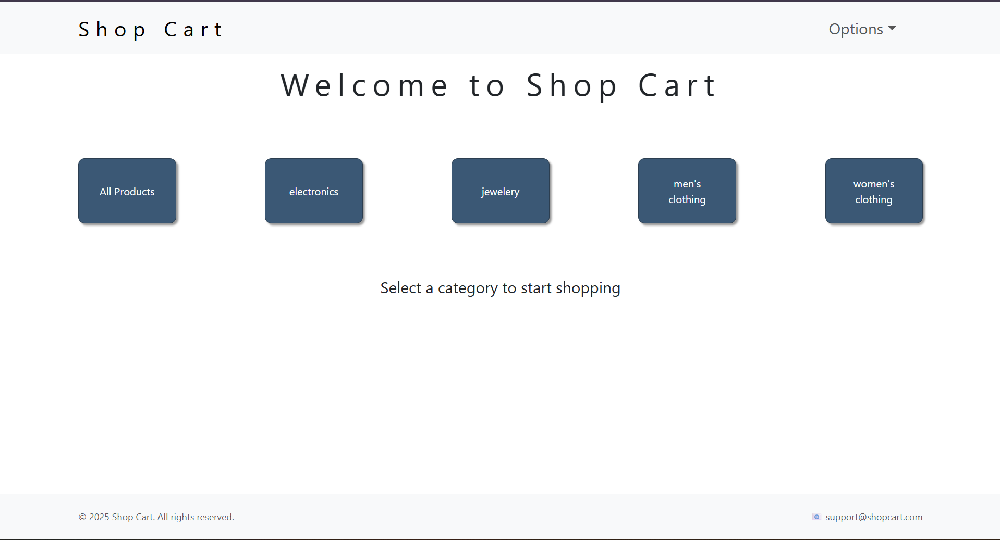
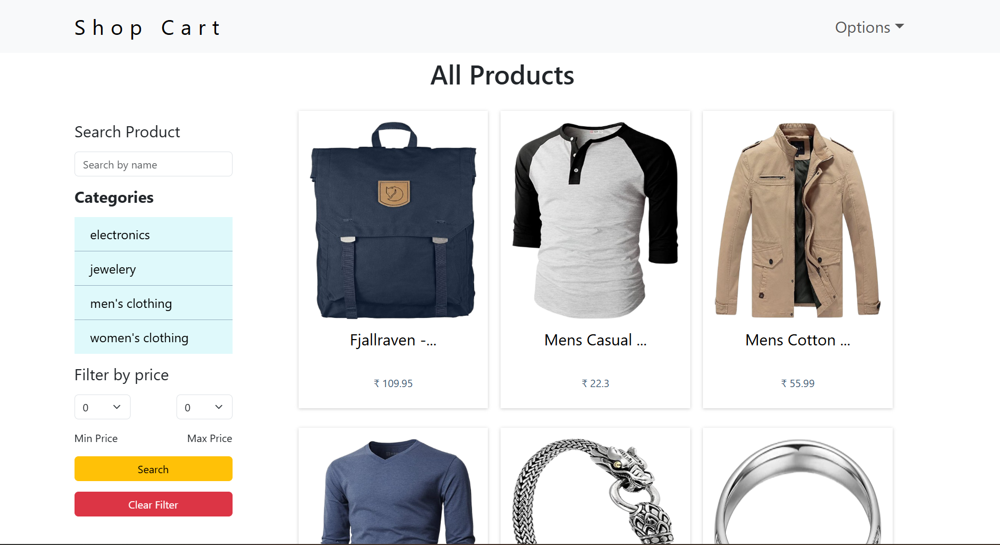
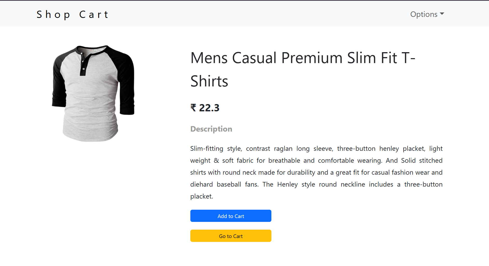
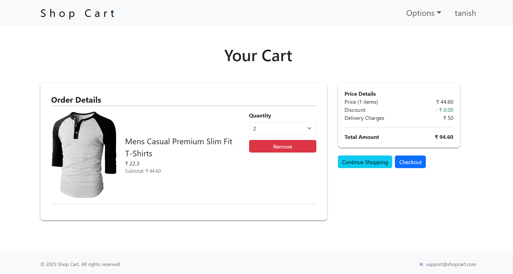
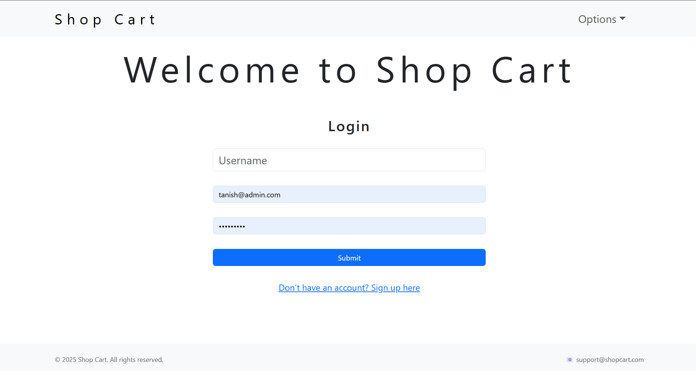
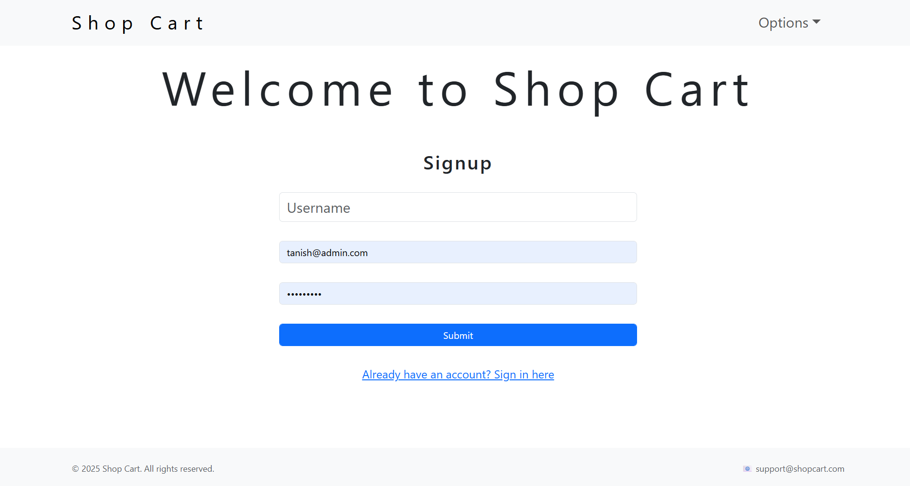

# 🛒 Shop Cart — E-Commerce Frontend
 
A full-featured e-commerce web application frontend built with **React** and **Vite**, featuring product browsing, category and price filtering, a persistent shopping cart, and JWT-based authentication. Built as a hands-on project to strengthen practical skills in React, state management, REST API integration, and responsive UI design.
 
**Live Demo:** [https://shop-cart-kohl.vercel.app](https://shop-cart-theta-gules.vercel.app/)
 
---
 
## 📋 Table of Contents
 
- [Overview](#overview)
- [Features](#features)
- [Tech Stack](#tech-stack)
- [Project Structure](#project-structure)
- [Getting Started](#getting-started)
- [Environment Variables](#environment-variables)
- [Available Scripts](#available-scripts)
- [Key Implementation Highlights](#key-implementation-highlights)
- [Screenshots](#screenshots)
- [Future Improvements](#future-improvements)
---
 
## Overview
 
Shop Cart is a single-page e-commerce application where users can browse products across multiple categories, filter and search for items, manage a shopping cart, and complete a mock checkout flow — all backed by a REST API. The project was built to practice real-world frontend engineering patterns: component architecture, global state management with React Context, protected/conditional routing, and integrating a third-party backend API.
 
> **Note:** This repository contains the **frontend only**. It consumes a separately hosted REST API (Node.js/Express/MongoDB) for products, users, carts, and authentication.
 
---
 
## Features
 
- 🔐 **Authentication** — Sign up, sign in, and logout with JWT stored in HTTP-only cookies
- 🛍️ **Product Catalog** — Browse all products or filter by category
- 🔎 **Search & Filter** — Search by name and filter products by price range
- 🛒 **Shopping Cart** — Add items to cart, update quantities, and remove items in real time
- 💳 **Checkout Summary** — Dynamic price breakdown with discounts and delivery charges
- 📱 **Responsive Design** — Fully responsive layout built with Bootstrap/Reactstrap
- 🌐 **Persistent Sessions** — Stays logged in across page refreshes via secure cookies
- ⚡ **Fast Dev Experience** — Powered by Vite for instant hot module reloading
---
 
## Tech Stack
 
| Category            | Technology                          |
|----------------------|--------------------------------------|
| Framework            | React 18                            |
| Build Tool           | Vite                                 |
| Routing              | React Router DOM v6                  |
| State Management     | React Context API (User & Cart)      |
| HTTP Client          | Axios                                |
| UI Components        | Reactstrap + Bootstrap               |
| Auth                 | JWT (via HTTP-only cookies)          |
| Deployment           | Vercel                               |
 
---
 
## Project Structure
 
```
shop-cart/
├── src/
│   ├── apis/               # Centralized API endpoint definitions
│   ├── components/         # Reusable UI components (Header, Footer, ProductBox, etc.)
│   ├── context/             # React Context providers (UserContext, CartContext)
│   ├── helper/               # Utility/helper functions (e.g. fetchUserCart)
│   ├── hooks/                # Custom hooks (useCart, useCategory)
│   ├── pages/                 # Route-level page components (Home, ProductList, Cart, Login, Signup, etc.)
│   ├── routes/                 # Route configuration
│   ├── App.jsx                  # Root component, handles auth persistence
│   └── main.jsx                  # App entry point
├── public/
├── .env.example
└── package.json
```
 
---
 
## Getting Started
 
### Prerequisites
 
- Node.js (v18 or higher recommended)
- npm
### Installation
 
```bash
# Clone the repository
git clone git@github.com:Tanish866/Ecommerce-React.git
cd Ecommerce-React
 
# Install dependencies
npm install
 
# Set up environment variables (see below)
cp .env.example .env
 
# Start the development server
npm run dev
```
 
The app will be available at `http://localhost:5173`.
 
---
 
## Environment Variables
 
Create a `.env` file in the project root with the following variable:
 
```env
VITE_FAKE_STORE_URL=http://localhost:6400
```
 
Replace the value with your backend API's base URL (local or deployed).
 
---
 
## Available Scripts
 
| Command           | Description                              |
|--------------------|-------------------------------------------|
| `npm run dev`      | Starts the local development server       |
| `npm run build`    | Builds the app for production             |
| `npm run preview`  | Previews the production build locally     |
 
---
 
## Key Implementation Highlights
 
- **Global Auth State:** User authentication state is managed via React Context and synced with an HTTP-only JWT cookie, so the session persists across page reloads without exposing the token to client-side JavaScript.
- **Dynamic Filtering:** Category and price filters are driven entirely by URL search parameters (`useSearchParams`), making filtered views shareable and bookmarkable.
- **Optimistic Cart Updates:** Cart quantity changes and removals update the UI immediately after a successful API response, keeping the interface responsive.
- **Component Reusability:** Product cards, filters, and order line-items are built as reusable, prop-driven components to minimize duplication across pages.
- **Client-Side Route Protection:** Navigation adapts based on authentication state (e.g., showing Sign In vs. Sign Up vs. Logout dynamically in the navbar).
---
 
## Screenshots

| Home Page | Product Listing |
|:---:|:---:|
|  |  |

| Product Details | Shopping Cart |
|:---:|:---:|
|  |  |

| Login Page | Signup Page |
|:---:|:---:|
|  |  |

---
 
## Future Improvements
 
- Add unit and integration tests (React Testing Library)
- Implement wishlist/favorites functionality
- Add order history and a real payment gateway integration
- Improve accessibility (ARIA labels, keyboard navigation)
- Add dark mode support
---
